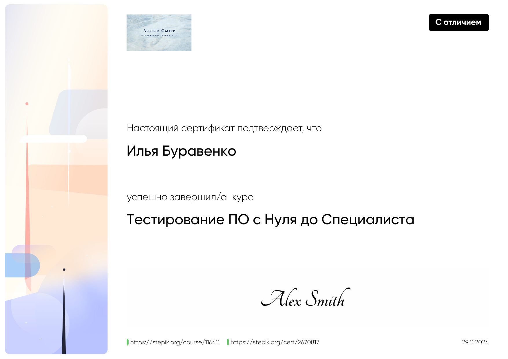
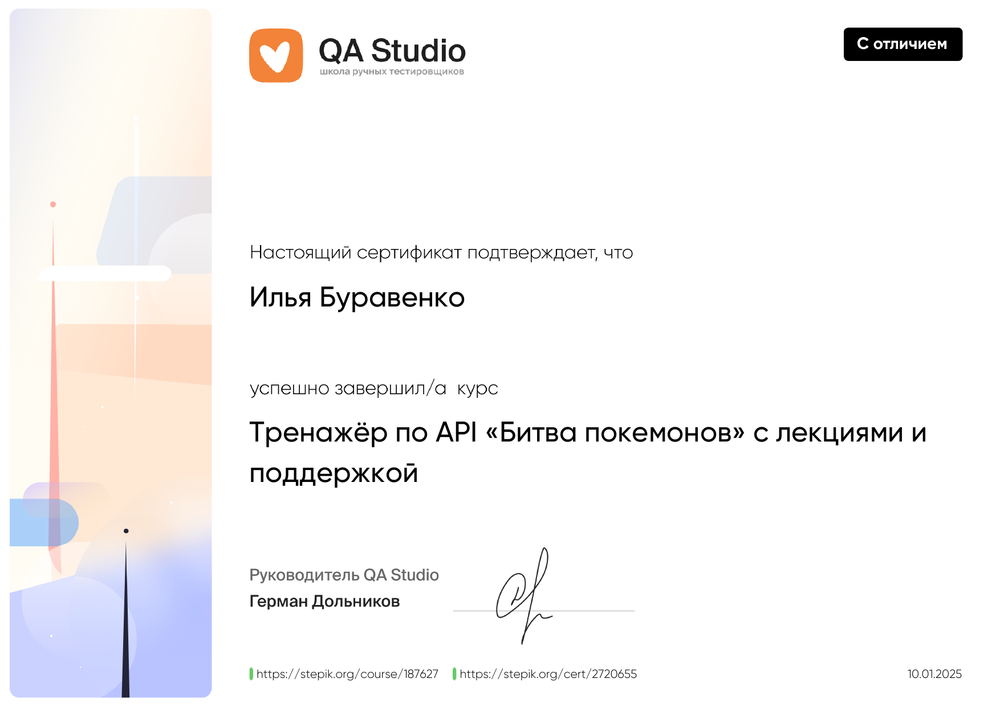
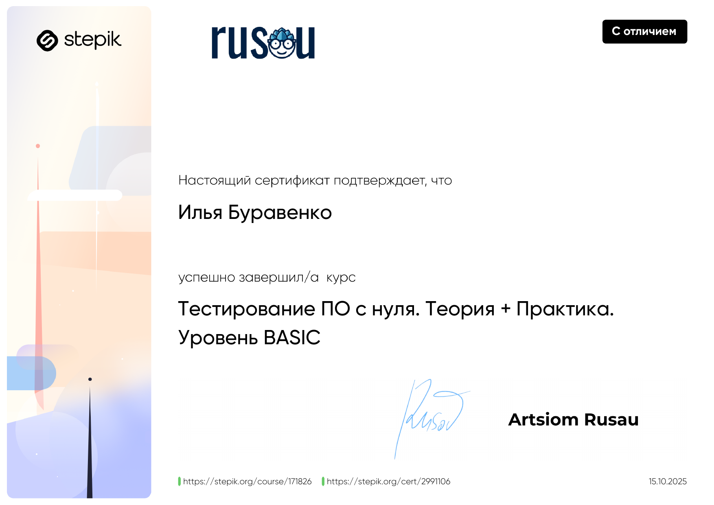
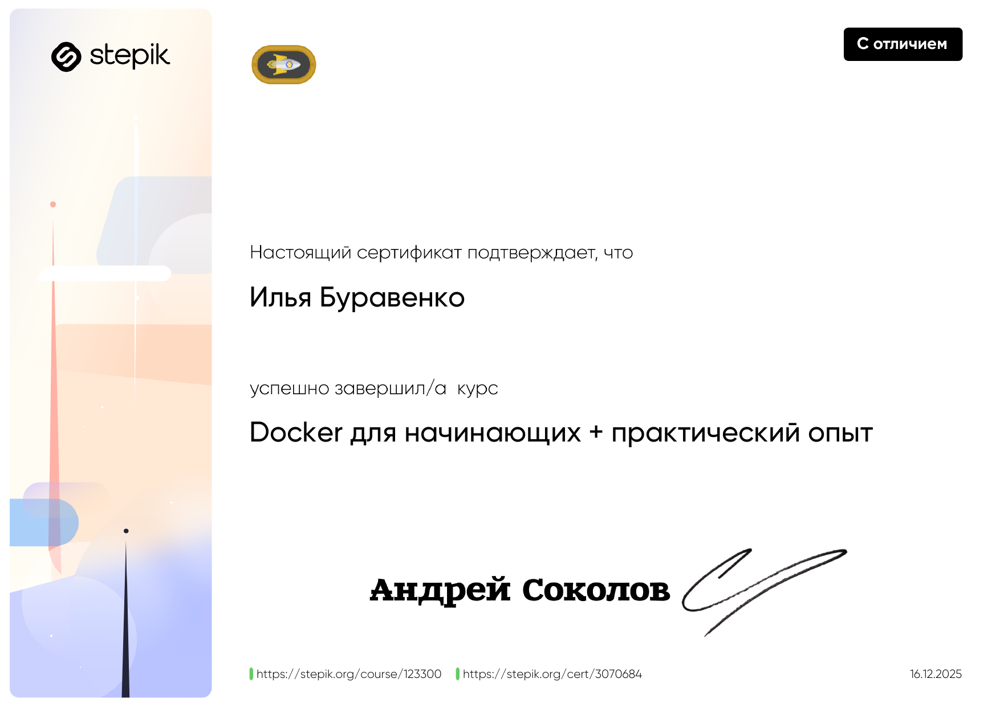
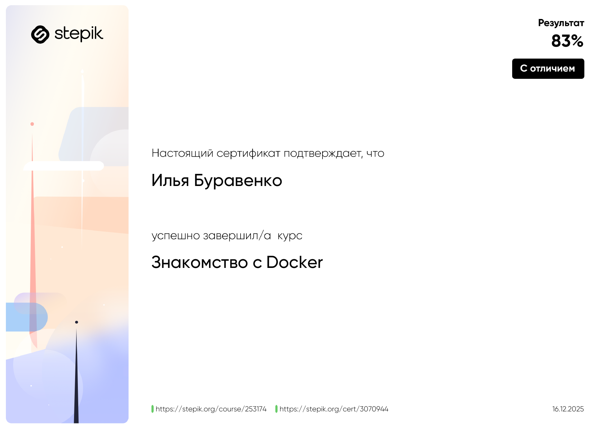
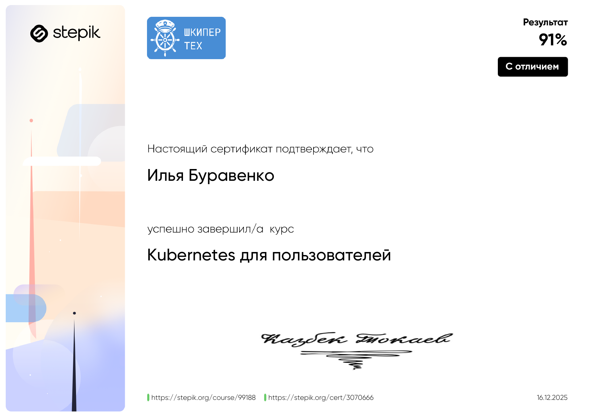
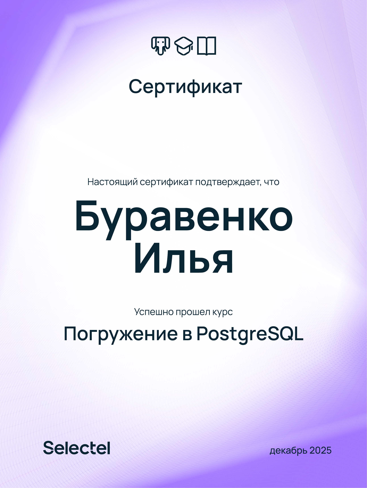
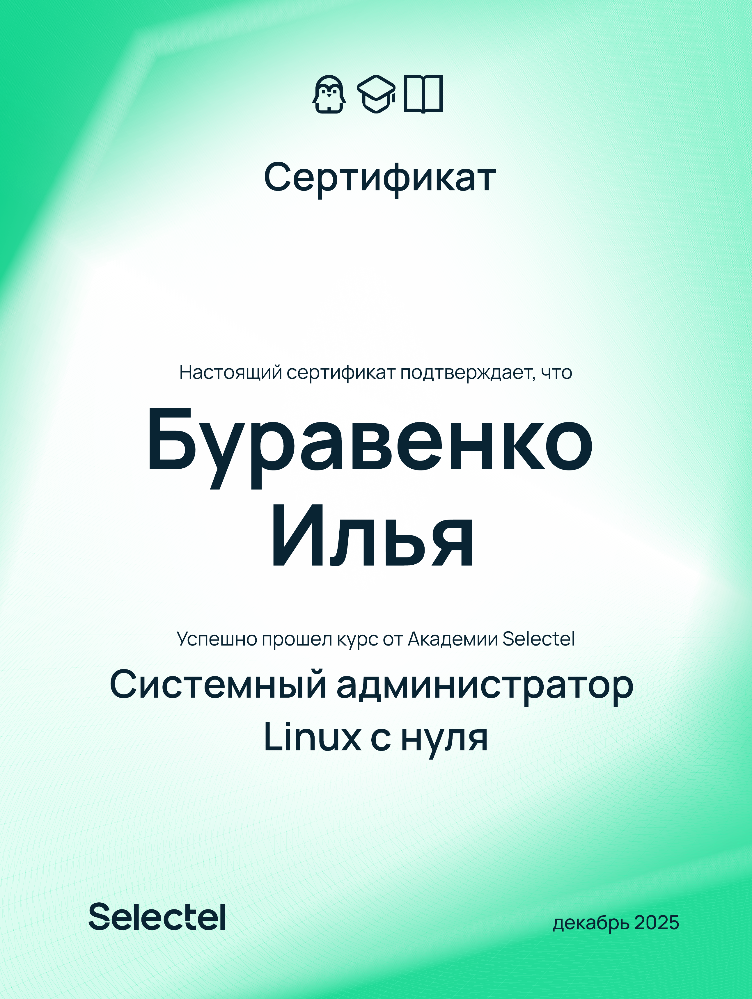
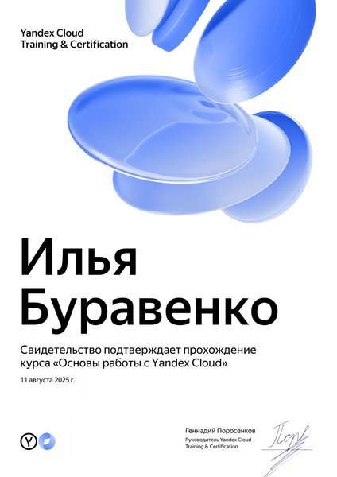

# QA Portfolio — Буравенко Илья

**Контакты:** [Telegram](@iburavenko) | ilyaburavenko@yandex.ru | Новосибирск

---

## Опыт работы

**Fintech IQ** — Специалист технической поддержки 1 линии *(апр 2025 — окт 2025)*
- Послерелизная проверка корректности функционала, деплой для отдельных стеков
- Глубокий анализ инцидентов: воспроизведение ошибок, анализ логов (Grafana/Loki, Kibana), работа с DevTools
- Инцидент-менеджмент в Jira, ведение Post mortem
- Работа с PostgreSQL и ClickHouse для выгрузки данных и проверки корректности
- Формирование подробных баг-репортов для разработчиков с логами, запросами и шагами воспроизведения

**Управление федерального казначейства по НСО** — Старший специалист 2-й линии тех. поддержки *(сен 2023 — фев 2025)*
- Анализ ошибок фронтенда через DevTools, проверка HTTP-ответов
- SQL-запросы для диагностики и выгрузки данных
- Тестирование новых версий ПО по чек-листам
- Эскалация проблем разработчикам с оформлением баг-репортов

---

## Проекты

### 📚 [Bookshop](./bookshop-project/)
Тестирование учебного книжного магазина.

- API-коллекция в Postman: 21 запрос с assertions для всех эндпоинтов
- 47 тест-кейсов (поиск, корзина)
- 8 задокументированных баг-репортов

### 🎮 [ForwardTest](./forwardtest/)
Тестовое задание на позицию Junior QA — десктопный симулятор ПДД, метод чёрного ящика.

- 22 тест-кейса (5 тест-сьютов)
- 5 баг-репортов

---

## Сертификаты

### Тестирование ПО с Нуля до Специалиста — Stepik, 11.2024

### Тренажёр по API «Битва покемонов» — QA Studio, 01.2025

### Тестирование ПО с нуля. Теория + Практика. BASIC — Rusau, 10.2025

### Docker для начинающих + практический опыт — Stepik, 12.2025

### Знакомство с Docker — Stepik, 12.2025

### Kubernetes для пользователей — Stepik, 12.2025

### Системный администратор Linux с нуля — Selectel, 12.2025

### Погружение в PostgreSQL — Selectel, 12.2025

### Основы работы с Yandex Cloud — Yandex Cloud Training, 08.2025

---

## Навыки

**Тестирование:** функциональное, регрессионное, API, граничные значения, негативное, тест-дизайн

**Инструменты:** Postman, Swagger, Jira, Confluence, Git, Chrome DevTools

**БД:** PostgreSQL, ClickHouse, SQL

**Инфраструктура:** Docker, Kubernetes, Linux, Yandex Cloud

**Мониторинг:** Grafana, Kibana

**Английский:** B2
